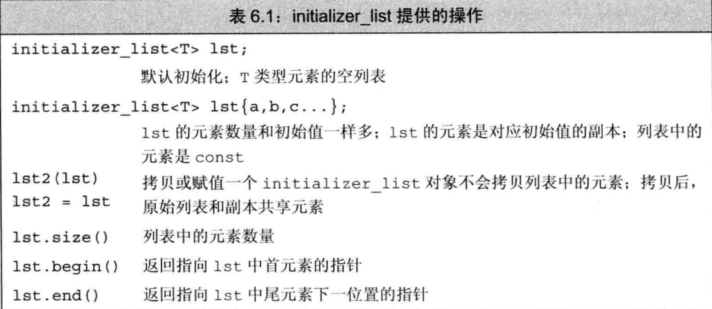

# 函数

### 1. 函数基础

> 内容包括：返回值，函数名，0至多个参数的列表和函数体

* 调用函数的两项工作：

  1. 实参初始化为对应的形参
  2. 将控制权转移给被调用函数

  > 调用return时返回值用于初始化调用表达式的结果，控制权回到main

  #### 1.1 实参和形参

  * 实参是形参的初始值
  * 求值顺序没规定
  * 形参可以为空

  ```cpp
  void f1() {} //隐式
  void f2(void) {} //显示
  ```

#### 1.2 函数返回类型

> 返回类型不能是数组类型或者函数类型，但可以是指向数组或函数的指针。

* 形参和函数体定义的变量都称为是局部变量

* 块执行期间的对象叫自动对象
* 函数开始时为形参申请空间，函数终止形参消亡

#### 1.3 局部静态变量

> 在程序的执行路径上第一次经过对象定义语句时初始化，并且直到程序终止才消亡，因此函数结束也不会对它有影响

```cpp
#include <bits/stdc++.h>
using namespace std;

size_t count_c() {
    static size_t cnt = 0;
    return ++cnt;
}

int main() {
    for (int i = 0; i != 10; ++i)
        cout << count_c() << endl;
    return 0;
}
 ///会输出1到10
```

* 如果没有显示初始值，他将执行值初始化内置类型为0

#### 1.4 函数声明

> 可只有声明没有定义

* 声明可以省略形参

```cpp
void print(int a, int b);
```

* 建议把函数放在头文件里声明源文件定义

* 一个项目只能有一个main函数，这个函数就是开始执行的函数

#### 1.5 函数传参

> 所有的传参都跟新定义变量赋值一样

```cpp
如同：新定义了形参
    int a, b; //假设这是实参
	int c = a, *d = b, &e = b; 这是形参
        所以c改变不了a，但d,e可以
```

* 不支持拷贝的类型可以通过引用来访问对象

  * 因为某些对象占用的内存可能会很大，所以对于那些实参我们尽量用引用

  > 当无需修改值时用引用比较省内存

  >  可以利用引用参数当多余需要的返回值，因为函数只能返回一个值

### 2 const 形参和实参

> 当形参时const时，会忽略掉顶层const

* 形参有const时，传实参，是不是常量都行
* 但传过来的也是只能读不能写
* 虽然允许多定义相同名字的函数，但参数需不同，const的参数类型是和没加const相同的。
* 但利用decltype取到的还是const类型

```cpp
void fun(const int i ){}
void fun(int i) {} //错误上面定义过了
```

我们可以使用非常量初始化一个底层const，但反过来就不行

```cpp
vector<int>::iterator ff(const int &k, vector<int>::iterator i) {
    for (int j = 0; j < k; ++j, ++i) {
        cout << *i << endl;
        cin >> *i;
    }
    return i;
} //这个也能更改容器里的元素
```

#### 2.1 数组形参

> 特性：不能拷贝数组，数组通常会将其换成指针所以传数组就是传头指针

```cpp
void print(const int*);
void print(const int[]);
void print(const int[10]);//上面三个等价，这里的维度是我们期望数组含有多少，实际不一样
int i = 0, j[2] = {0, 1};
print(&i); 
print(j); //都可以因为j转换成&j[0];
```

* 使用时必须保证不能越界

* 字符数组本身可以做结束标记符

  * 对于int等这样的就不行了

  ```cpp
  char cp[] = "sdad";
  if (*cp) //若cp不是空字符
  ```

* 管理数组的好方法就是传首尾字符的指针

  ```cpp
  void print(const int *beg, const int *end) {
      while (beg != end)
          cout << *beg++ << endl;
  }
  int j[2] = {0, 1};
  print(begin(j), end(j));
  ///或者可以选择传人数组维度
  ```

* 允许变量定义成数组引用，形参也行

  * 但要规定好维度属于类型的一部分

  ```cpp
  void print(int (&arr)[3]) {
      for (auto i : arr)
          cout << i << endl;
  }//是可以的
  ```

  #### 2.2 多维数组

  > 首元素的本身就是数组，指针就是一个指向数组的指针。所以第二维的维度大小也是数组类型的一部分，不能省略

  ```cpp
  void print(int (*arr)[3], int rowsize) { //指向由3个数组元素构成的数组指针
  }
  void print(int arr[][3], int rowsize) {} //等价
  ```

  #### 2.3 main

  主函数是可以传参的，

  ```bash
  prog -d -o ofile data0
  ```

  ```cpp
  int main(int argc, char *argv[])//
      argc: 字符串的数量
       argv: 字符串数组
  ```

  按照执行输入的顺序输入你的argv

#### 2.4 含可变形参的函数

> 当不确定传入实参的数量时，c++11新标准提供了两种主要方法：如果所有的实参类型相同，可以传递一个名为initializer_list 的标准类型；
>
> 如果实参的类型不同，我梦编写一种特殊函数可变参数模板

* c++还有一种特殊形参类型``省略符``,可以用它表示可变数量的实参

  >  一般用于与c函数交互的接口程序

##### 2.4.1 initializer_list 形参

> 标准库类型用于表示某种特定类型的值的数组定义在同名的头文件里



* 和vector一样时模板类型

* 要定义所含元素类型

  ```cpp
  void error_msg(initializer_list<string> il) {
      for (auto beg = il.begin(); beg != il.end(); ++beg)
          cout << *beg << " ";
      cout << endl;
  }
      error_msg({"nihao", "sda"});
  ```

* 元素永远是常量无法更改

* 传递值得序列，必须放入花括号中

  ```cpp
  void error_msg(int e, initializer_list<string> il) {
      cout << e << ": ";
      for (auto &i : il) {
          cout << i << " ";
      }
      cout << endl;
  }
      string as = "sddad", bs = "sdada";
      error_msg(4,{as, bs});
  ```

##### 2.4.2 省略符形参

> 为了c++访问某特殊得c代码设置得，这些代码用了varargs的c标准库

* 大多数类类型对象无法通过省略符传递形参正确拷贝

* 只能出现在形参列表的最后一个位置

* 省略号对应的类型无需检测

  ```cpp
  void foo(parm_list, ...);//指定部分形参类型,后面的逗号是可选
  void foo(...); //
  ```

### 3. 返回类型和return语句

#### 3.1 return

1. 无返回值void型时有隐式return，可不用加return结束

2. 有返回值，返回的类型必须与函数返回的类型一致或隐式转换成返回类型

   ###### 值是如何被返回的

   > 和初始化一个变量或形参的方式完全相同：返回值用于初始化调用点的一个临时量，该临时量就是函数调用的结果。

   ```cpp
   const string &shortstring(const string &s1, const string &s2) {
       return s1.size() < s2.size() ? s1 : s2;
   } //形参和返回类型都是const string 的引用，不管是调用函数还是返回值都不会真正的拷贝对象。
   
   ```

   * 不要指向和引用局部变量
     * 函数结束后会消亡

```cpp
int *pp() {
    int k = 5;
    return &k; //错误引用局部变量
}
```

*  引用返回左值

> 调用一个引用的函数得到左值，其他右值

```cpp
string &sot(string &s1, string &s2) {
    return s1.size() <= s2.size() ? s1 : s2;
}
string as = "ddad", bs = "sdada";
string &k = sot(as, bs);
k += "100";
cout << as << endl;// 这个能更改as
/--------------------------------------------------------------
char &get_va(string &str, string::size_type ix) {
    return str[ix]; //假定索引有效
}
int main() {
    string s("a val");
    cout << s << endl;
    get_va(s, 0) = 'A';
    cout << s << endl; /// 输出A val
    return 0;
}
```

* 列表初始化返回值

* > c++11 新标准， 函数可以返回花括号包围的值的列表。可以为类似其他返回结果

  * 用来对函数返回的临时量进行初始化

    ```cpp
    vector<string> process() {
        return {"","sds"};
    }
    ```

    * main函数的返回值可机器隐式写入
      * 返回值0表示成功，非0含义根据机器而定，我返回其他的并没报错
      * 但程序会告诉你你返回的是啥


#### 3.2 递归

> 函数调用了自身，函数调用自身是会用到程序栈空间的

#### 3.3 返回数组指针

> 数组不能拷贝，所以函数返回数组只能通过数组指针或者引用

```cpp
typedef int arrT[10]; //arrT 是一个类型别名，他表示的类型是含有10个
using arrT = int[10]; //arrT等价声明
arrT* func(int i); //func 返回一个指向10个整数的数组指针
```

也可以直接声明：

```cpp
int arr[10];
int *p1[10];
int (*p2)[10] = &arr; // p2是个指针，它指向含有19个整数的数组
```

* 维度必须确定

  所以函数的为：

  ```cpp
  int (*func(int i))[10];
  func(int i) 表示需要一个int类型的实参
  (*func(int i)) 意味着我们可以对函数调用的结果执行解引用
  int (*func(int i))[10] 表示解引用得到的是一个大小为10的数组，数组的元素是int型的
  ```

#### 3.4 使用尾置返回类型

> c++11新标准中还有一种可以简化上述func声明的方法就是尾置返回类型
>
> 任何函数定义都可以用，对于复杂的最有效

* 在形参列表后面并以一个->符号开头。为了表示函数真正的返回类型，类型的位置放auto

  写法如下：

  ```cpp
  auto func(int i) -> int(*)[10]; 表示和上面的等价
  auto func(int (*a)[3]) -> int(*)[3] {
      (*a)[1] = 3;
      return a;
  }
      int a[] = {0, 1, 2};
      func(&a);
  ```

* 使用decltype

  通过函数返回的指针指向哪个数组，就可以用此关键字的返回类型

  ```cpp
  int odd[] = {1, 3, 5, 7, 9};
  int even[] = {0,2,4,6,8};
  decltype(odd) *arr(int i) {
      return (i%2) ? &odd : &even;
  }
  ```

  

### 4 函数重载

> main函数不能重载

* 名字相同但形参列表不同的我们称为函数重载

  ```cpp
  void print(const char *cp);
  void print(const char *beg, const int *end);
  ...
```
  
  * 编译器会根据传入实参类型去选择
  
  定义重载函数