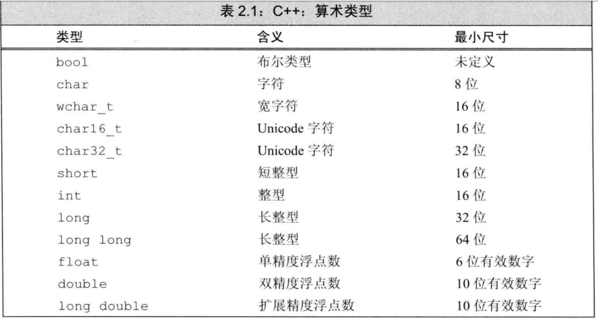
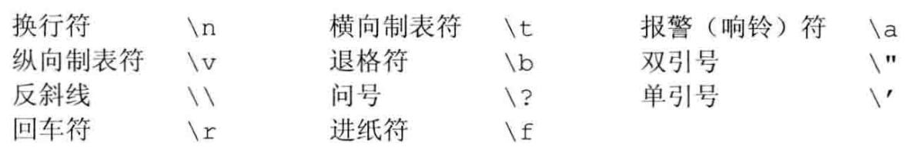
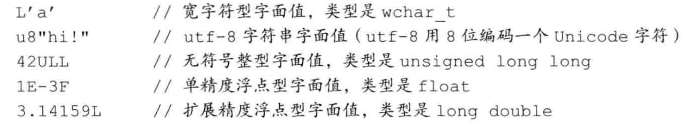
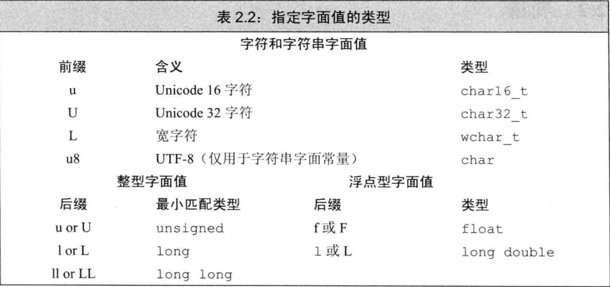
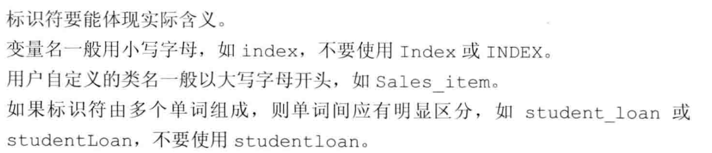
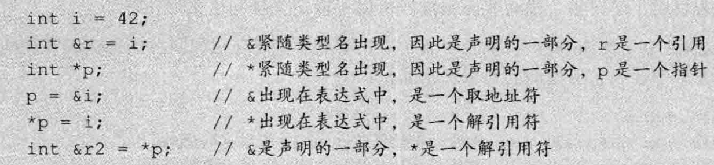

# 变量和基本类型（基于c++）

1. <a href="#d1">内置基本类型</a>
   1. <a href="#d1_1">算术类型</a>

### <div id = “d1">1. 基本内置类型</div>

* `算术类型`: 字符、整数、布尔值、浮点数
* `空类型`：不对应具体的值，用于特殊场合

#### <div id = “d1_1">1.1 算术类型</div>

* 整型（布尔，字符）
* 浮点型



##### 1.1.1 存储

* 字节占8比特
* 字占32或64，也就是4~8字节

> 每个字节与一个数字（地址）关联
>
> 浮点型的第一个字节是ISO-Latin-1字符集，则就是分号，所以可以知道是浮点型

1. 浮点型
   1. float 32比特
   2. double 64比特
   3. long double 96~128比特
2. 字符型 
   1. char 8比特
      1. signed char 8比特
   2. unsigned char 8比特

#### 1.2 类型转换

> ​	unsigned char c = -1; // c =255
>
> ​	signed char c = 256; //c2 未定义

1. 含无符号的表达式

   * 例如：整数和无符号的运算会自动转化成无符号

     ```cpp
     unsigned u = 10;
         int i = -42;
         cout << i+i << endl;
         cout << u+i << endl;
         //-84
         //4294967264 32位
     ```

   * 无符号的负数时为取模后的值

#### 1.3 字面值

> 20 `十进制` 024 `八进制` 0x14 `十六进制`

* 字符串的组成是字符数组（字符串的末尾多一个‘\0’)

  ```cpp
  //分开字符串写法
  std::cout << "你好"
       "NO" << std::endl;
  // 你好NO
  ```

#### 1.4 转义序列

​	

* 也可以用`\x 十六进制` `\八进制`

* 数值对应的字符集

  

> ​	UL 会根据数值决定是unsigned long 还是unsigned long long

* 前缀为字符
* 后缀为整型或浮点型
* aen的后面数值表示a*10^n^

### 2. 变量

> 何为对象？
>
> ---
>
> `对象` :是指一块能存储数据并具有某种类型的内存空间。
>
> 对象也叫变量，而值是只读数据

#### 2.1 初始值

```cpp

    ///a 先被定义然后赋值， 随后用于初始化b
    double a = 1.1, b = a*2;
```

* 列表初始化 int a{0};

#### 2.2 变量声明和定义

​	C++语言支持`分离式编译`机制，可分成若干个文件独立运行。

* 声明：变量声明规定了变量的类型和名字，不分空间
* 定义：申请存储空间，也可能给变量赋初始值

```cpp
extern int i; // 声明i并非定义i
int j; //声明j并定义j
```

> 变量只能被定义一次，但可以声明很多次

#### 2.3 表示符



#### 2. 4 名字的作用域

* 全局作用域
* 块作用域

##### 2.4.1 外层作用域

```cpp
#include <bits/stdc++.h>
#include <iostream>
using namespace std;
int reused = 42;//全局
int main(){
    int unique = 0; // 块
    cout << reused << " " << unique << endl;
    int reused = 0;
    cout << reused << endl; //局部覆盖了全局
    cout << ::reused << endl; //全局
    {
        int reused = 5;
        cout << reused <<endl; //局部覆盖局部
        cout << ::reused <<endl; //全局
    }
    return 0;
}
```

### 3. 复合类型

> 一条声明语句由一个人基本`基本数据类型` 和一个`声明符`列表组成

#### 3.1 引用

> c++11添加的 `右值引用`

* 定义：为对象起另外一个名字，引用类型引用另一种类型通过将声明符写成&d的形式。
* 引用必须初始化
* 引用并非对象

```cpp
    int i, &ri = i;
    i = 5; ri = 10;
    cout << i << " " << ri << endl; //10 10
```

#### 3.2 指针

​	指针是“指向”另外一种类型的复合类型。实现了间接访问。

指针存放的是变量地址

```cpp
int i;
int *pi = &i;
int *p = pi;
```

*指针的四个状态*

* 指向一个对象
* 指向紧邻对象所占的空间的下一个位置
* 空指针
* 无效指针

> 在指针前面加*号得到指针p得对象。



空指针

```cpp
int *p1 = nullptr;//c++11得特殊字面值
int *p2 = 0;
int *p3 = NULL; //include <cstdlib>
```

> 注意不能给指针赋int变量。

