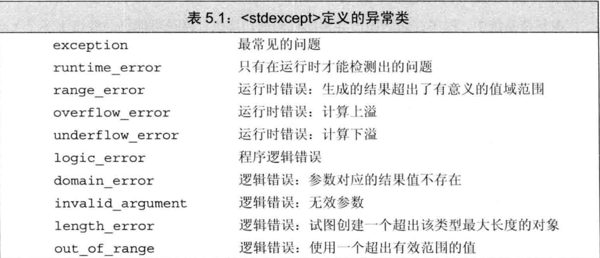

# 语句

### 1. 简单语句

>  大多数语句都以分号结束，`i+5;`就是表达式语句：

* 作用就是执行并丢弃求值结果

* 只有一个空格的是空语句包含一个分号

  ```cpp
  ival = v1 + v2;; //第二个分号表示一条多余的空语句
  while(iter != svec.end());//循环体是空语句
  ++iter;                   //不进入循环
  
  ```

#### 1.1 复合语句

> 用花括号括起来的语句和声明的序列，块

* 不以分号结尾
* 表示作用域

* 空块等价与空语句

#### 1.2 语句作用域

* 如果要访问作用域外的要访问控制变量，那必须也定义在作用域外；

  > 但定义在作用域内的对象在作用域结束后好像并没有删除
  >
  > 只是不能用此名字访问了

  ```cpp
      int *p;
      {
          int k = 5;
          p = &k;
      }
      cout << k; //错误在作用域外没有声明它
      cout << *p; //正确指向了作用域内的它，内存没有消亡一样可以用
  ```

  >  if else 尽量加上花括号，以防代码混乱不清

  * else 会选择在最近尚未匹配的if进行匹配 -》 在没有花括号分开的情况下

    ```cpp
    if () 1
        if () 2
        else 3 //3跟2匹配
            
    if () { 1
        if () 2
    }
    else 3 //3跟1匹配
    ```

    

### 2 switch 语句

> 提供多个选择

```cpp
switch(ch) { //选择开始位置往下执行直到break 或者结尾
    case 'a':
        ++cnt;
        break;
    case 'b':
        ++cnt;
    case 'c':
        ++cnt;
    break;
    default: //上面都没匹配到
        cnt = 100;
}
// ch == 'a' or 'c'  cnt = 1;
// ch == 'b' cnt == 2;
// ch 都不是 cnt == 100;
```

* case 标签必须是整型常量表达式
* 也不能有两个一样的标签
* default 后面必须有个语句或者空块

#### 2.1 内部变量定义

* 在`switch` 中如果case ‘’:定义变量没有添加花括号也就是在同个switch作用域内是会被定义的
* 但是并不执行初始化，所以只能声明
* 要初始化必须设置新的作用域

```cpp
    switch(ch) {
    case '1': {
        int i = 5; //正确 在新的作用域
    }
        int j;
        int k = 5; //错误不能初始化
   		break;
    case '3':
        i = 3; ///报错并不在同个作用域内
        j = 6; ///正确 都在switch内
        cout << j;

    default:
        {
        }
    }
```

* 同样变量使用也要在变量初始化下面

### 3. 迭代语句

> 也叫循环，执行到某个条件才停下来

#### 3.1 while

```cpp
while (condition) // 不能为空 真才往下执行
    statement //循环体内创建的变量都会经历创造销毁 
```

* 只有最后一次循环所声明的对象内存会被保留，其他次都会被销毁

  证明：

  ```cpp
  long long ks = 5;
      long long *p[3];
      p[0] = &ks;
      int t = 1;
      while (t <= 2) {
          long long k = t*2;
          p[t++] = &k;
      }
      cout << *p[0] << " ";
      cout << *p[1] << " ";
      cout << *p[2] << " ";
  // 输出： 5 4 4   表示对象k每次创造都在同一个空间，所以p[1],p[2]指向了同一个对象
  ```


#### 3.2 老旧for

>  老旧版跟往常c语言一样

```cpp
for (1 ;2 ; 3){
  	4  
}
1为首要执行
2 进入循环和每次循环的判断
3 为每次结尾的执行
    三个内容都可以为空
4 为函数体
省略判断，相当于默认为true

```

#### 3.3 范围for语句

> c++11新标准引入的简单for语句

* 可遍历容器或序列的所有元素

  ```cpp
  for (declaration : expression) //expression 必须是一个序列 比如花括号括起来的初始值列表、数组等对象，都能放回迭代器的begin和end成员
      statement;
  declaration 定义一个变量、序列的每个元素都必须能转换成该变量的类型。auto最好用
  ```

  * 范围for中会预存end()值，一旦在循环中添加元素或删除元素，end函数的值可能变的无效

#### 3.4 do while 语句

> 和while 相似

* 区别会先执行一次函数体

```cpp
do {
    statement;
}while (condition);
    //两个内容都不能为空
```

* condition 不能放入变量声明
* condition 使用的变量必须声明在循环体外。

### 5. 跳转语句

> c++定义了4种跳转语句 break, continue, goto 和return

#### 5.1 break

* 负责结束离它最近的循环语句或者switch语句

#### 5.2 continue

* 终止本次迭代，并立即开始下一次迭代

* 只能出现在迭代语句内部中

#### 5.3 goto

> 不要在程序中使用goto语句会把程序变得难以理解和修改
>
> 所以我们稍微认识一下就行

* 无条件跳转到同一个函数内的另一个条语句‘

```cpp
goto label;
end: return;//作为goto的目标
```

和switch类似

```cpp
//,,,,
goto end;
int ix = 10; //错误goto语句绕过了一个带初始化的变量定义
end:
错误 ix的声明被绕过了
ix = 42;
begin: 
	int sz = 4; // 合法
```

### 6. try 语句块和异常处理

> 异常是指存在于运行时的反常行为，这些行为超出函数正常功能的范围。

> 例如：丢失数据库连接，意外输入等，处理反常可能是设计所有系统最难的一部分。
>
> 当程序的部分检测到一个它无法处理的问题时，需要用到异常处理。此时，检测出问题的部分应该发出某种信号表示遇到故障。

* 信号发出方无须知道故障将在何处解决，
* 检测出问题的部分也就完成了任务

* `thorw`表达式(throw expression), 异常检测部分使用throw 表达式来表示他遇到的问题，throw引发了异常
  * 一套异常类(exception class)，用于在throw表达式和有关的catch子句之间传递异常的信息
* `try`语句块(try block), 异常处理部分使用try语句块处理异常。try语句块的关键字try开始，并以一个或者多个catch子句结束。
  * 语句块中代码抛出的异常通常会被某个catch子句处理，
  * catch子句“处理”异常，所以叫异常处理代码

#### 6.1 throw 表达式

> 程序的异常检测部分使用 throw 表达式引发一个异常。throw后面紧随一个表达式，其中表达式类型就是抛出异常的类型后面在跟一个分号

```cpp
Sales_item item1, item2; //自己定义的一个类对象
cin >> item1 >> item2;
if (item1.isbin() == item2.isbin()) {
    cout << item1+item2 <<endl;
    return 0;//成功
} else {
    cerr << "Data must refer to ..." << endl;
    return -1;//错误
}
///-----------------------上面可改写为 同等
if (item1.isbin() != item2.isbin())
    throw runtime_error("Data must refer to ..."); // 抛出异常，该异常为runtime_error的对象，终止函数，并把控制权交给能处理该异常的代码
cout << item1+item2 <<endl;
```

* >  runtime_error 是标准库异常类型的一种， 定义在`stdexceot`头文件中。
  >
  > 必须初始化此对象，方式：给它一个string对象伙子c的字符串

#### 6.2 try语句块

`try` 语句块的通用语法形式是

* 一开始是try，随后跟着一个块，块后跟着一个或多个catch子句

  * `catch`: 包含三个部分 
    * 关键字 catch
    * 括号内一个对象的声明（异常声明）
    * 一个块

* >  当选中了某个 catch子句处理异常后，一旦完成，程序就跳转到最后一个catch子句之后的那个语句进行
  >
  > 也就是只执行一个catch

```cpp
try {
	program-statements
} catch (exception-declaration) {
    handler-statements
}catch (exception-declaration) {
    handler-statements
} //...

```

* 没个块都是独立作用域，声明的其他地方都不能访问

* try可以嵌套

  ```cpp
  runtime_error er("error a+b<10");
      while (cin >> a >> b) {
          try {
              int i;
              if (a+b > 10)
                  throw runtime_error("a+b>10");
              else if (a+b < 10)
                  throw er;
              cout << a+b << endl;
  
          }catch (runtime_error err){
  
              cout << err.what()
                  << "\n Try Again? Enter y or n" <<endl;
              char c;
              cin >> c;
              if (! cin || c == 'n')
                  break; // 跳出while
          }
      }
  ```

  * 如果最终还是没能找到任何匹配的catch子句，程序转到名为termi nate的标准
    库函数。该函数的行为与系统有关，一般情况下，执行该函数将导致程序非正常退出。

#### 6.3 标准异常

* exception 头文件定义了异常类exception 。他只报告异常的发生，不提供其他
* stdexcept 包含了几种常见了异常类如下：



* new也定义了bad_alloc异常类型
* type_info 定义了bad_cast 异常类型

* 我们只能默认初始化的方式初始化exception，bad_alloc和bad_cast对象，不允许为这些对象提供初始值。

* 只定义了一个what成员函数