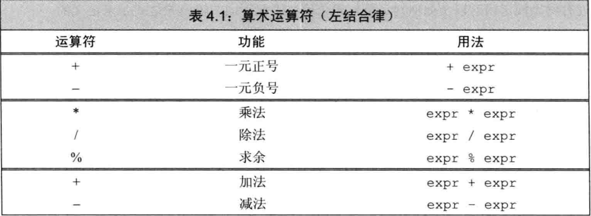
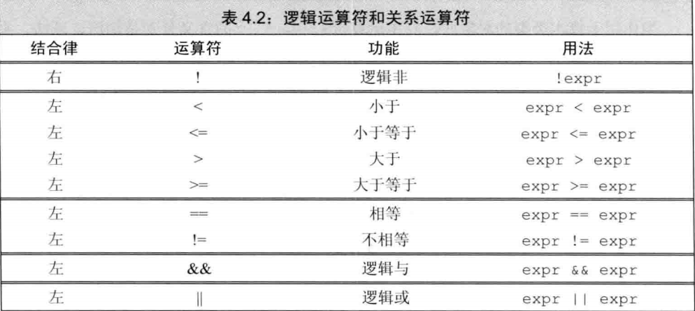

# 表达式

### 1. 基础

> c++ 定义了一元和二元运算符

* 一元：`&, * `:取地址和解引用
* 二元： `==, *` 相等和乘法
* 三元：作用与三个对象的

#### 1.1 组合运算符和运算对象

* 优先级

* 结合律

* 运算对象转换

* 重载运算符

  * IO库的>>和<<运算符和类对象的运算

* 左右值

  * 左值赋值，用作对象的身份
  * 右运算，用对象的值
  * 有时候左值也做运算
    * 取地址符返回指向该对象的指针这个指针是右值
    * 内置解引用，下标的求值结果都是左值

  > 例如
  >
  > decltype 左右值有所不同，如果是左值得到引用类型
  >
  > ```cpp
  > int *p = &a;
  > decltype(*p) <-是一个int& 型，因为解引用是左值
  > decltype(&p) <-是一个 int**类型，也就是指向指针的指针
  > ```

#### 1.2 优先级与结合律

> 普通模式下的运算符就不说了
>
> 在优先级相同的情况下，但是没说按照什么顺序求值。大多情况都不明确
>
> 括号无视优先级与结合律

* 同优先级的没定义顺序的运算来说，是无法判断的

  ```cpp
  cout << i << " " << ++i <<endl;
  我们是不知道i是否先加1的。所以程序是错误的
  ```

  * 规定顺序的有

    * `&&` 先求左侧运算值
    * `||`、`?:`,`,`都是有顺序的

  * 求值顺序、优先级、结合律

    如：`f()+g()*h()+j()`中

    * 优先级决定，`g()`的返回值和`h()`的返回值相乘
    * 结合律决定，`f()`的返回值先与`g()`和`h()`的乘积相加，所得结果与`j()`的返回值相加
    * 对于函数的调用顺序是没规定的

  * > 所以在做这类运算时，函数之间必须要没有关系

    



> bool不是0就是1

* 浮点型不能取余
  * 取余的定义： `m%n`如果不等于0，则它的符号和m相同
  * m%(-n)等于m%n， (-m)%n 等于-(m%n)。

#### 1.3 逻辑和关系运算符

> 关系运算符作用于算术或指针类型，逻辑-》任意转bool



* 短路求值

  * `||`：对于左运算对象为假才进行右运算
  * `&&`：对于左运算对象为真才进行右运算

  