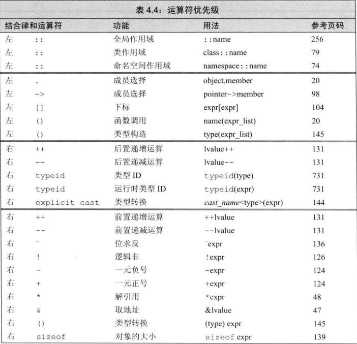
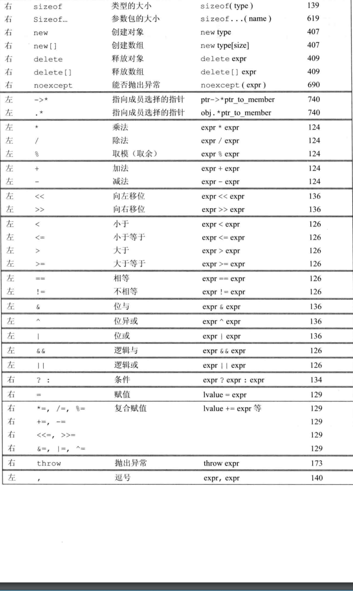

# 表达式

### 1. 基础

> c++ 定义了一元和二元运算符

* 一元：`&, * `:取地址和解引用
* 二元： `==, *` 相等和乘法
* 三元：作用与三个对象的

#### 1.1 组合运算符和运算对象

* 优先级

* 结合律

* 运算对象转换

* 重载运算符

  * IO库的>>和<<运算符和类对象的运算

* 左右值

  * 左值赋值，用作对象的身份
  * 右运算，用对象的值
  * 有时候左值也做运算
    * 取地址符返回指向该对象的指针这个指针是右值
    * 内置解引用，下标的求值结果都是左值

  > 例如
  >
  > decltype 左右值有所不同，如果是左值得到引用类型
  >
  > ```cpp
  > int *p = &a;
  > decltype(*p) <-是一个int& 型，因为解引用是左值
  > decltype(&p) <-是一个 int**类型，也就是指向指针的指针
  > ```

#### 1.2 优先级与结合律

> 普通模式下的运算符就不说了
>
> 在优先级相同的情况下，但是没说按照什么顺序求值。大多情况都不明确
>
> 括号无视优先级与结合律

* 同优先级的没定义顺序的运算来说，是无法判断的

  ```cpp
  cout << i << " " << ++i <<endl;
  我们是不知道i是否先加1的。所以程序是错误的
  ```

  * 规定顺序的有

    * `&&` 先求左侧运算值
    * `||`、`?:`,`,`都是有顺序的

  * 求值顺序、优先级、结合律

    如：`f()+g()*h()+j()`中

    * 优先级决定，`g()`的返回值和`h()`的返回值相乘
    * 结合律决定，`f()`的返回值先与`g()`和`h()`的乘积相加，所得结果与`j()`的返回值相加
    * 对于函数的调用顺序是没规定的

  * > 所以在做这类运算时，函数之间必须要没有关系

    


> bool不是0就是1

* 浮点型不能取余
  * 取余的定义： `m%n`如果不等于0，则它的符号和m相同
  * m%(-n)等于m%n， (-m)%n 等于-(m%n)。

#### 1.3 逻辑运算符

> 关系运算符作用于算术或指针类型，逻辑-》任意转bool


* 短路求值
  * `||`：对于左运算对象为假才进行右运算
  * `&&`：对于左运算对象为真才进行右运算

#### 1.4 关系运算符

> 左结合律

```cpp
if (i < j < k) //像这种 它属于 先执行 i<j 得到 一个布尔值 再用这个布尔值跟k比较，也就是如果k>1就一定是真所以尽量不要这样用
```

#### 1.5 赋值运算符

> 左运算对象必须是一个可修改的左值， 初始化不是赋值

* c++11 允许用``{}`` 括起来赋值

``` cpp
int k;
k = {3.14}; //错误： 窄化转换 如果初始化对象是内置类型，初始化列表，严格不能损失精度，所以会报错
vector<int> v;
vi = {0, 1, 2, 3, 4, 5}; //现在v 有6个元素了
```

* 右结合律
  * i = j = 0；

* 未定义左右运算顺序

#### 1.6 自加自减

* 解引用

  ```cpp
  cout << *pd++ << endl; //先输出当前值在后移一位
  cout << *++pd << endl; //先移一位在后输出当前值
  
  ```

#### 1.7 成员访问运算符

> 点和箭头运算符，可访问成员；

```cpp
string s1 = "a string ", *p = &s1;
auto n = s1.size();
n = (*p).size();
n = p->size(); //三者意义相同
```

* 解引用优先级低于引用

#### 1.8 条件运算符

> `?:`允许我们把if-else 简短嵌入

* 都是左值运算

```cpp
fi = (gr > 90) ? "sss"
    			: (gr < 60) ? "fail" : "pass";
```

* 嵌入时要写括号优先级很低

#### 1.9 位运算

> 把对象当二进制进行运算

* 左结合律

| 符         | 功能   |
| ---------- | ------ |
| ~          | 取反   |
| >><br /><< | 左右移 |
| &          | 位与   |
| ^          | 位异或 |
| \|         | 位或   |

* 若运算小整数将提升位较大的整数一般只转int
* 若对象为负值，那如何处理符号位依赖与机器，是未定义的行为
* 移动超届的会自动舍弃

```cpp
unsigned char bit = 0233; 
bit << 8 //会自动转int

```

* **位取反**

  * 1和0交换

  * 前面的位数都会补0

  * > 负数的反码为：除符号位外,原码各位取反,反码加1,得负数的反码.
    >
    > 补码为反码+1，计算机中正数是用原码显示，负数用补码表示

     

    ```cpp
    char bit = 1; 0~31 1
    ~bit == -2 
    ```

    >  根据机器所得 ： 得到的1~31 0 ，因符号位为1所以是补码，原码就为1 0~29 10

##### 1.9.1 位与、位或、位异或运算符

> 都是两个对象上的逻辑操作

* 现在的计算机都是32位的所以int可以移动32位

* 如果要超过就可以在前面转型

  ```cpp
  1ULL << 34; //unsigned long long
  q &= ~(1<<27); //让27位为0
  ```

  

#### 1.10 移位运算符 

* 满足左结合律

#### 1.11 sizeof运算符

> 返回一条表达式或一个类型名字所占的字节数

* 右结合， `size_t` 类型

```cpp
sizeof(type);
sizeof expr; //返回表达式结果类型的大小，不计算运算的值
sa_dat data, *p;
sizeof(sa_dat); //这个类型的空间大小
sizeof data; //同上
sizeof p; //指针的大小
sizeof *p; //指针所指空间的大小
```

* 对数组会得到数组得总大小
* 对string 和vector 只会返回类型固定大小不会计算总大小
* `sizeof`返回的是常量表达式，所以可以用作数组维度

#### 1.12 逗号运算符

> 从左向右的求值顺序
>
> 先求左侧的表达式求值，然后将值丢弃，`,`号**真正的结果只有右侧的表达式**

### 2. 类型转换

> 面对浮点转整型会损失精度

* 比int小的整数会转int
* 在条件中非布尔会转布尔
* 初始化右侧转左侧
* 等等

#### 2.1 算术转换

> 一个算术类型转另一个算术类型

* 有浮点时整数会转浮点
* char中(wchar16_t, wchar32_t) 会提升到int，unsigned int。。。。选择最小的，能容纳原来所有可能值的

```cpp
short + char ; //都转int
```

* 有无符号的结果依赖机器，根据所占空间大小进行升级和转换

#### 2.2 隐式转换

* 数组用decltype 关键字，或取地址，sizeof 及typeid 等时不会发生转换
* 指针只有 0， nullptr 可以和 非常量的``void*``和``const void*``
* 继承类之间的指针转换

#### 2.3 显示转换

>  强制转换

* 一个命名的强制转换形式

  * 一旦类型不符合，会产生未定义的后果

  ```cpp
  cast-name<type>(expression);
  type目标类型，expression 要转换的值
      cast: static_cast, dynamic_cast, const_cast, reinterpret_cast 中的一种
          
  double sl = static_cast<double>(j)/i;
      int a[10] = {0, 1, 2, 3, 4};
      void* S = &a; //非常量对象存入void*
      int *dp = static_cast<int*>(S); //将void*转换回到初始的指针类型
  ```

* `const_cast`

  * 去掉const性质

  ```cpp
  const char *pc;
  const char s[] = "123";
  const char *cp = s;
  char *p = const_cast<char*>(pc);//但p是未定义的行为去掉const操作
  char *p1 static_cast<char*>(cp); //错误static_cast 不能改const性质
  static_cast<string>(cp); //正确，把字面值转换了，并不会更改掉cp
  const_cast<string>(cp); //错误，const_cast只改变常量属性
  char *p1 const_cast<char*>(cp); //正确 可以通过p1改const性质
  p1可以修改常量cp的值，但cp自己不行    
  ```

* `reinterpret_cast`:

  > 为运算对象的位模式提供较低层次上的重新解释

  ```cpp
  int *ip;
  char *pc = reinterpret_cast<char*>(ip);
  与旧式的 char *pc = (char*) ip; 一样
  ```

  

